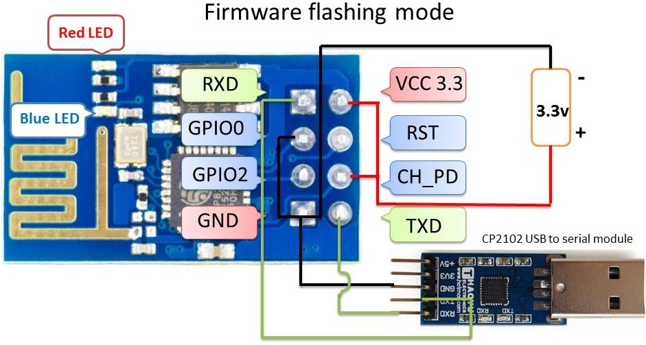
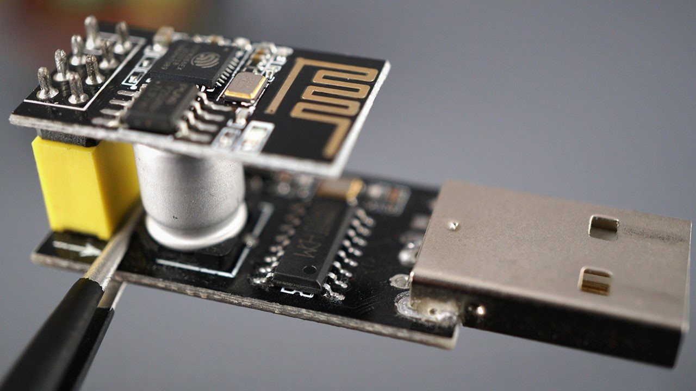
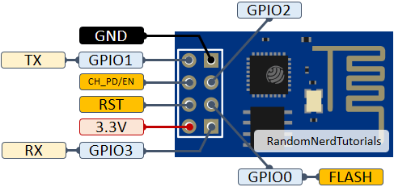
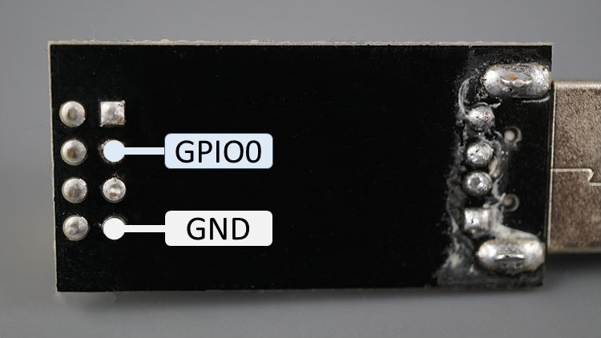
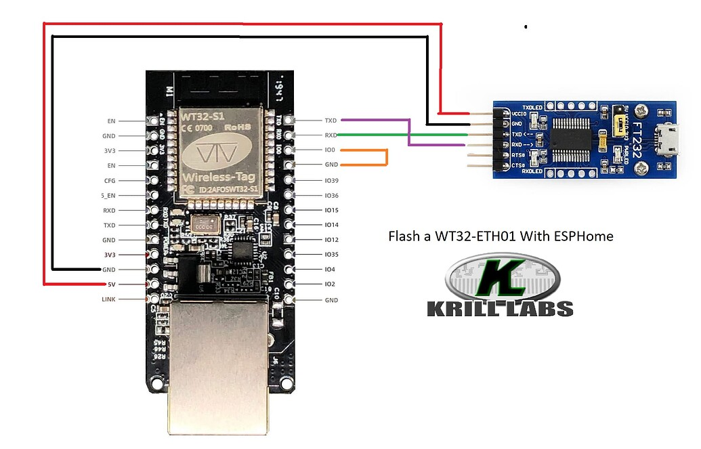
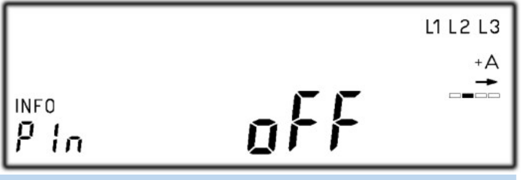
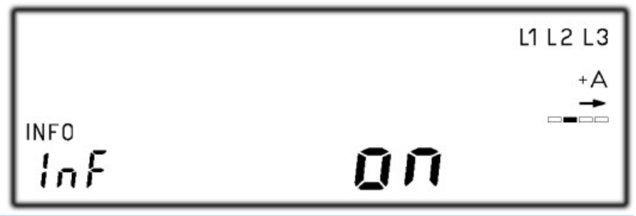

# Notes

## ESP8266

Before you begin ensure that the a `CP2101` or `CH340` is used for flashing and NOT an alternative, also ensure that the `V3V` pin is in use.


Do not use Arduino IDE to upload binaries, Arduino IDE has a weird bug, so export with `Sketch` > `Export compiled Binary` and `Sketch` > `Show Sketch Folder`,
then the `bin` file is in the `build` directory, that needs to be uploaded with `esptool`.

Don't forget to close Arduino IDE before switching to `esptool`.
Otherwise Arduino IDE will keep your `/dev/ttyUSB0` device busy,
and won't allow `esptool` to use it.

### Flashing with dupont cables only:



### Flashing with incomplete flasher:

This flasher is lacking a button to enter flashing mode:


 
* **To be able to flash the device, `GPIO0` must be connected to ground (`GND`) while the device boots up.**
  Flashing will not work if you connect these wires after the device has already been booted up.




* **Unless you modify the flasher, these two pins have to be shorted, before pluggin in the USB cable:**



```bash
### Chip ID
myvenv/bin/esptool --port /dev/ttyUSB0 --chip esp8266 --no-stub chip-id

### Erase Flash if needed
myvenv/bin/esptool --port /dev/ttyUSB0 --chip esp8266 erase_flash

### Flash new build
myvenv/bin/esptool --port /dev/ttyUSB0 --chip esp8266 write_flash --flash_mode dio --flash_size detect 0x0 esp8266-midea-dehumidifier.ino.bin
```

Once flashed via serial, flashing via [OTA](https://github.com/JAndrassy/ArduinoOTA)
works just fine from Arduino IDE, but keep in mind that re-flashing does not wipe the configuration data,
which is often the blocker of a successful startup/connection.

## WT32-ETH01
Check the Flashing Mode



* **To be able to flash the device, `GPIO0` must be connected to ground (`GND`) while the device boots up.**
  Flashing will not work if you connect these wires after the device has already been booted up.
* `GPIO0` to `GND` (orange) is like holding boot on the WT32-ETH01. **Make sure you remove this after flashing** otherwise the device won't boot!

If the device is essentially bricked and doesn't respond on USB nor on ETH,
then keep pulling out and putting the serial adaper into the laptop's USB,
and keep trying the erase:

```bash
python -m esptool --chip esp32 --port /dev/ttyUSB0 erase-flash
```

Once that is successfull, ensure that you can ID the chip by MAC:

```bash
### There is no Chip ID so use MAC address instead for ID
myvenv_latest/bin/esptool --port /dev/ttyUSB0 --chip esp32 --no-stub read-mac
```

```bash
esphome clean-all
esphome run wt32-eth01-SML-Hichi-IR.yaml --device 192.168.1.126
```

## Hichi IR ttl

Connectors:

* Brown: VCC 3.3 - 5V
* White: GND
* Green: onto TX
* Yellow: onto RX

First always test it with directly connected TTL (i.e. `ttyUSB0`):

```bash
stty -F /dev/ttyUSB0 9600
stty -F /dev/ttyUSB0 raw
cat /dev/ttyUSB0 | hexdump -e '16/1 "%02x " "\n"'
```

If that works then the IR is functional an properly connected.
Start reading locally first via 
[test_asyncio.py](https://github.com/Ferenc-/pysml/blob/master/examples/test_asyncio.py):

```bash
./test_asyncio.py /dev/ttyUSB0
```

once that works set up ESPHome `stream-server` and read via network:

```bash
./test_asyncio.py socket://192.168.1.126:2001
```

## Holley DTZ541-ZEBA

If the meter is within secure perimeter, you might want to at least temporarily
disable the `PIN`:



But you definitely need to enable the `INFO`(`InF`) interface:



## Tasmota ZB Bridge


```bash
# Rename a new Hex named device to a friendly name
ZBName 0x3FDF,Smart-Bulb-001
# 153..500 = set color temperature from 153 (cold) to 500 (warm) for CT lights
ZBSend {"Device": "Smart-Bulb-001", "Send": {"CT": 153}}
ZBSend {"Device": "Smart-Bulb-001", "Send": {"CT": 500}}
ZBSend {"Device": "Smart-Bulb-001", "Send": {"Dimmer": 10}}
ZBSend {"Device": "Smart-Bulb-001", "Send": {"Dimmer": 100}}
ZBSend {"Device": "Smart-Bulb-001", "Send": {"Hue":"6"}}
ZBSend {"Device": "Smart-Bulb-001", "Send": {"Sat":"10"}}

# https://tasmota.github.io/docs/Zigbee/#sending-device-commands
# `Color	0..65534,0..65534: change the color using [x,y] coordinates	0x0300`
#
# Pick values from https://viereck.ch/hue-xy-rgb/, multiply by 65534 & truncate to integer.
# e.g: [ 0.640, 0.330 ] * 65534 = [41941.76  21626.22]

# Red
ZBSend {"Device": "Smart-Bulb-001", "Send": {"Color":"47839,17825"}}
# Blue
ZBSend {"Device": "Smart-Bulb-001", "Send": {"Color":"9830,3932"}}
# Green
ZBSend {"Device": "Smart-Bulb-001", "Send": {"Color":"19660,39320"}}
```

See https://templates.blakadder.com/ewelink_ZB-GW03.html for details.
The original Tasmota template is:
```json
{"NAME":"ZB-GW03",   "GPIO":[0,0,3552,0,3584,0,0,0,5793,5792,320,544,5536,0,5600,0,0,0,0,5568,0,0,0,0,0,0,0,0,608,640,32,0,0,0,0,0],"FLAG":0,"BASE":1}
```

```
# https://community.home-assistant.io/t/tasmota-sonoff-ethernet-based-gateway-configuration/729354
#backlog template {"NAME":"ZHA-bridge","GPIO":[0,0,5472,0,5504,0,0,0,5793,5792,320,544,5536,0,5600,0,0,0,0,5568,0,0,0,0,0,0,0,0,608,640,32,0,0,0,0,0],"FLAG":0,"BASE":1} ; module 0
# https://github.com/vahempio/Tasmota-for-eWeLink
backlog Template {"NAME":"ZB-GW03-V1.3","GPIO":[0,0,3552,0,3584,0,0,0,5793,5792,320,544,5536,0,5600,0,0,0,0,5568,0,0,0,0,0,0,0,0,608,640,32,0,0,0,0,0],"FLAG":0,"BASE":1} ; module 0

backlog rule1 on system#boot do TCPStart 8888 endon ; rule1 1 ; tcpstart 8888
# After this the console logs should say:
# 02:47:04.513 TCP: Starting TCP server on port 8888
```

socket://192.168.1.148:8888

```
# https://github.com/vahempio/Tasmota-for-eWeLink?tab=readme-ov-file#configure-your-zigbee-gateway-for-zha
```

In Home Assistant go to `Settings` -> `Devices & services`,
Under `Integrations` tab click the `+ Add integration` icon, search for `ZHA` integration and select `Zigbee Home Automation`.
1. `Adapter Type` choose `ZNP = Texas Instruments Z-Stack ZNP protocol: CC253x, CC26x2, CC13x2`
2. Under `Serial Port Settings` for `Serial Device Path` enter `socket://192.168.1.148:8888` and ensure `Serial port speed` is set to `115200`.
3. For `Serial port flow control` choose `software`.

# Go to Tasmota > 


###  Turn off WiFi permanently
For better stability, desactivate permanently the WiFi with:
```
Wifi 0
backlog rule2 on system#boot do Wifi 0 endon ; rule2 1
```
